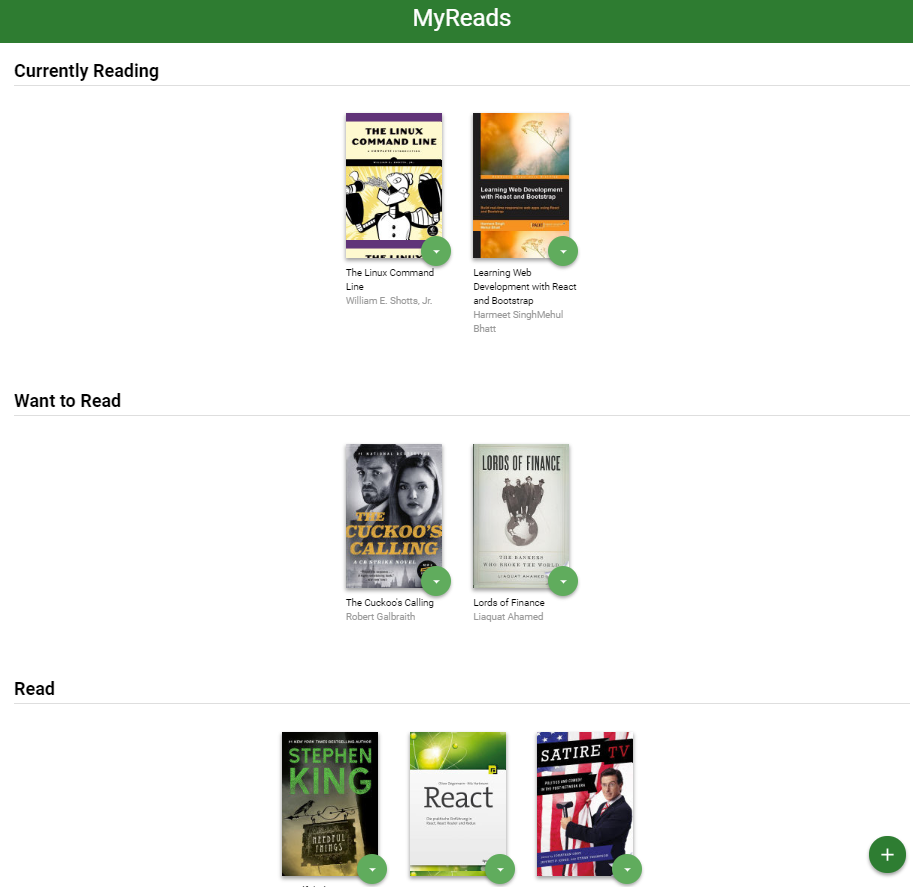

Myreads
===============================



This project was done as a part of the Udacity Front-End Web Developer Nanodegree Program.
The starter file for this project is located at https://github.com/udacity/reactnd-project-myreads-starter

App description
---
The app consists of two pages. The first page displays three shelves 'Want To Read', 'Currently Reading' and 'Read'. The user can navigate from the main page to the search page and use the input provided, to search for books according to their author/s or tittle. They can then add any of the books to the shelves on the main page.


Installation
---
To download this app,
1) Click the Clone or Download button then Download Zip.
2) Once downloaded, open the project's terminal and run the following commands,
```
npm install

```
```
npm install -g serve

```
```
serve -s build

```
This will open the project in your browser.
